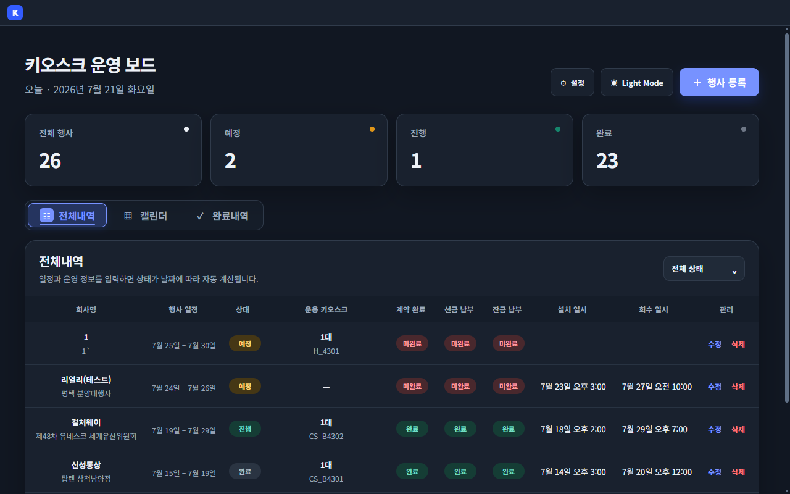
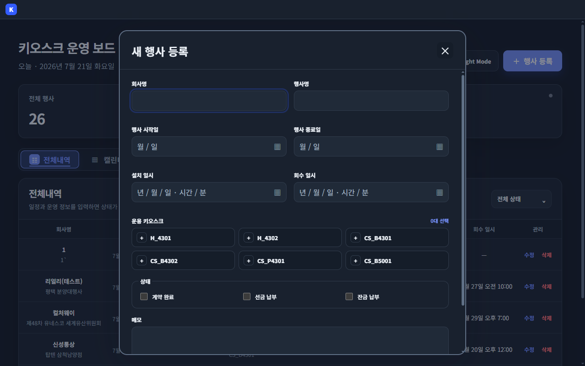
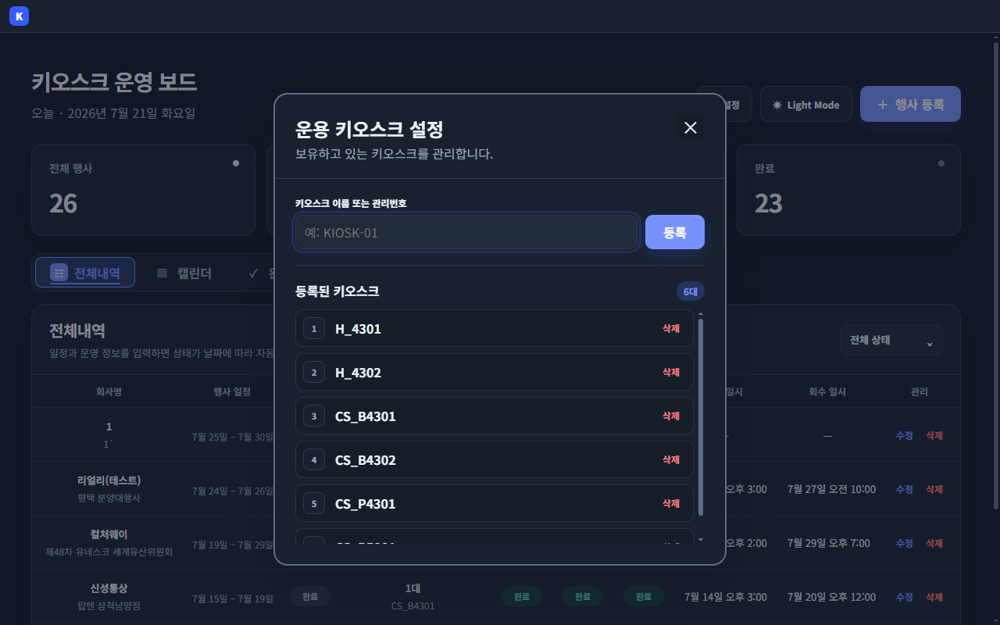
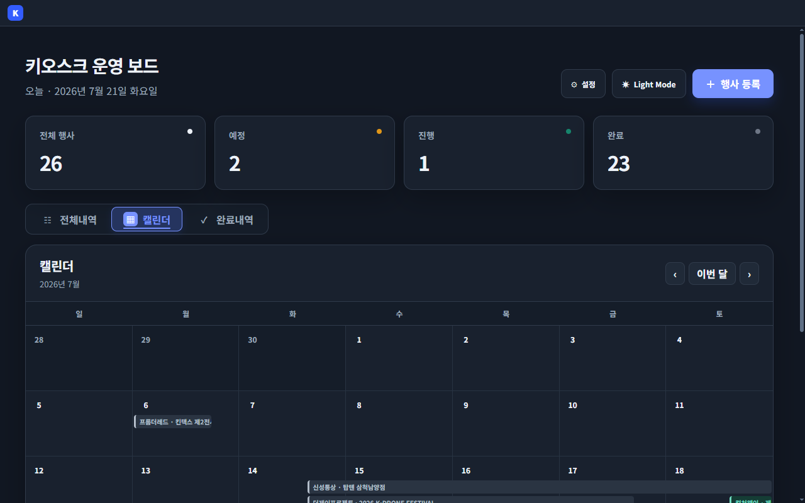
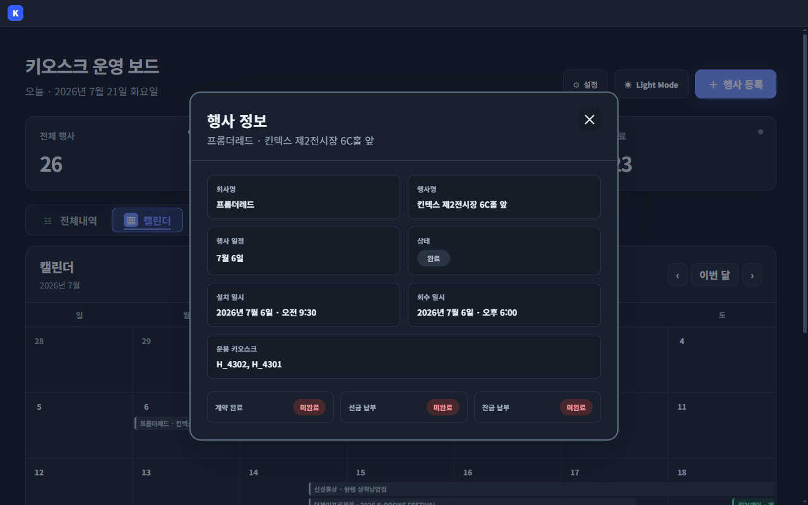
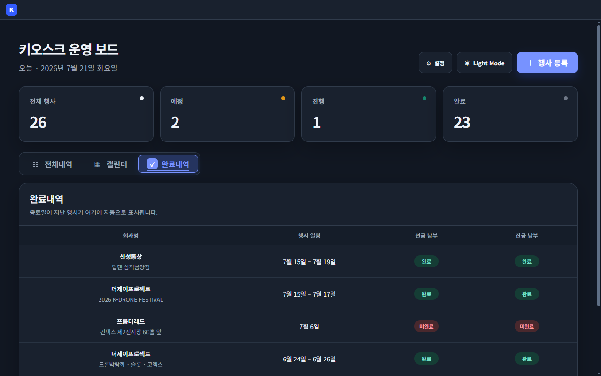
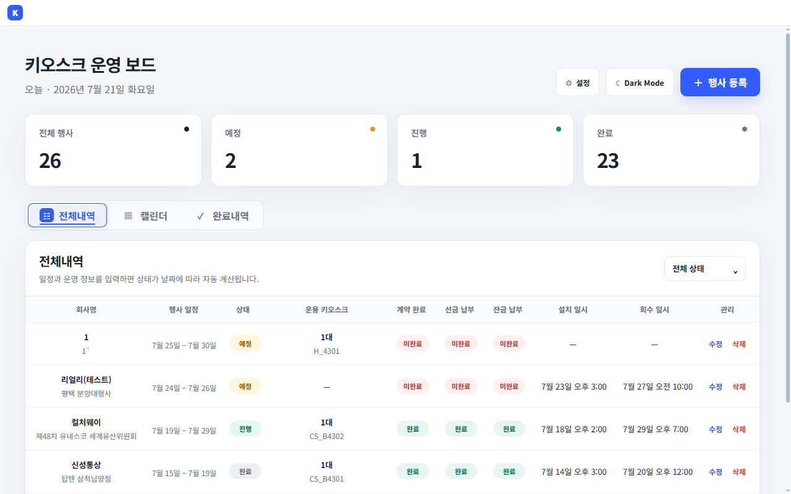

# KioskBoard

키오스크 행사 일정, 장비 배정, 계약 및 납부 상태를 한 화면에서 관리하는 Electron 데스크톱 앱입니다.

## 주요 기능

- 날짜에 따른 예정·진행·완료 상태 자동 계산
- 전체내역, 월간 캘린더, 완료내역 제공
- 설치·회수 시각을 반영한 캘린더 행사 막대
- 운용 키오스크 등록 및 행사별 다중 배정
- 다른 행사와 시간이 겹치는 키오스크 배정 방지
- 계약, 선금, 잔금 완료 상태 즉시 변경
- 캘린더 행사 클릭 시 상세 정보 확인
- 라이트·다크 모드와 Windows 네이티브 타이틀바 지원
- 로컬 저장소 기반 행사 및 설정 보존

## 주요 화면

### 전체 내역과 운영 상태

행사 일정에 따라 예정·진행·완료 상태를 자동 계산하고 계약, 선금, 잔금 상태를 한 화면에서 관리합니다.



### 행사 등록과 키오스크 배정

행사 기간과 설치·회수 일시를 입력하고, 해당 시간에 운용할 수 있는 키오스크를 선택해 배정합니다.



### 운용 키오스크 설정

보유한 키오스크의 이름 또는 관리번호를 등록하고 목록에서 관리합니다.



### 월간 캘린더

설치 시점부터 회수 시점까지 이어지는 행사 일정을 월간 캘린더에서 확인합니다.



### 캘린더 행사 상세

캘린더의 행사 막대를 선택하면 일정, 설치·회수 시각, 배정 장비와 납부 상태를 팝업으로 확인합니다.



### 완료 내역과 납부 상태

종료된 행사를 모아 보고 선금·잔금 납부 여부를 즉시 변경할 수 있습니다.



### 라이트·다크 모드

작업 환경에 맞춰 라이트 모드와 다크 모드를 전환할 수 있습니다.



## 개발 실행

```bash
npm install
npm start
```

## 검증

```bash
npm run lint
npx tsc --noEmit
```

## Windows 패키징

```bash
npx electron-forge package --platform=win32 --arch=x64
```

생성된 실행본은 `out/kioskboard-win32-x64/`에 위치합니다.
